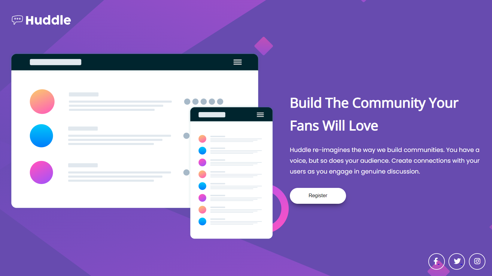

# Desafio do Frontend Mentor - Huddle landing page 

## Entendendo o desafio 💻

◽ Construir a página de destino a partir dos designs fornecidos no código inicial.

◽ Os usuários devem ser capazes de visualizar o layout ideal para a página, dependendo do tamanho da tela do dispositivo.

## Tecnologias utilizadas:

 
    
    
    

## Prática:

Neste projeto pude colocar em prática conhecimentos de HTML e CSS avançado com display flex, juntamente com as suas respectivas propriedades. 

Além de exercitar as habilidades de planejamento, Clean Code, Responsividade com o uso de Medias queries e versionamento com o Git.
  
## Visualização ✨
A página está responsiva, caso queira navegar nela em seu desktop ou celular, basta acessar o seguinte link:

## Observação importante 📝
Este desafio foi proposto no módulo de HTML e CSS Avançado do curso DevQuest voltado para Desenvolvimento Web Front-end.

Disponível em: Frontend Mentor (https://www.frontendmentor.io)
[]

